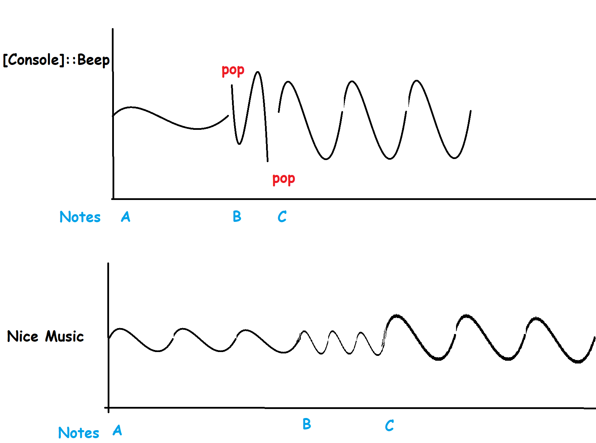

# PwshTunes

This is a quick hack to allow me to play garbage tunes in PowerShell scripts by providing a MIDI-esque file for a monophonic tune using an adaptation of 
https://www.undocumented-features.com/2020/10/23/announcing-the-end-of-a-script-with-a-powershell-music/ (cheers Aaron!)  
  
Using `[Console]::Beep()` seems to have some issues with audio drivers which use noise reduction because the driver takes a while to let the sound out e.g. on laptop/monitor speakers or bluetooth devices.  
To work around it you can open a Youtube video in the background on low volume to keep the audio device active.  

Another quirk of `[Console]::Beep()` is that it cuts sine waves in half so you get a lot of pops and crackles as it switches notes, I reduced this by adding a pause between notes (https://en.wikipedia.org/wiki/Staccato) which can be set in the pstune file e.g. `Staccato 3`



## Use
Download this repo, cd into the directory and import the PowerShell Module to get started.
```pwsh
Import-Module .\Modules\PwshTunes.psm1
Invoke-Tune -Path .\Examples\PocketMon.pstune
```
